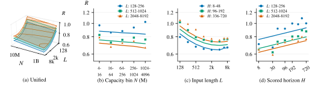
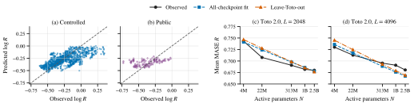

#  A Unified Scaling Law for Time Series Foundation Models



*Figure 1. One law connects model capacity, input length, and forecasting horizon. Curves show fitted responses; markers summarize observed performance.*



*Figure 3. Prediction on Controlled and GIFT Public results, followed by capacity-scaling curves for the held-out Toto 2.0 family.*

## Overview

**UniScale** studies how pretrained model capacity and available history translate into forecasting gains. Across **18,768 experimental cells, 21 checkpoints, and 23 dataset-frequency tasks in six domains**, we develop a five-parameter scaling law:

$$
\log R = c + \alpha\log H - \gamma\log L - \beta\log N\log L + q(\log L)^2.
$$

Here, $N$ is active model capacity, $L$ is effective input length, $H$ is the scored forecast horizon, and $R$ is MASE relative to Seasonal Naive at matching origins and horizons.

- **Capacity and history work together.** Capacity gains increase with history, while context gains diminish toward saturation (Figure 1).
- **The law predicts beyond its fitting data.** Fitted without Toto 2.0, it predicts the family's horizon-averaged capacity curves with **1.09% and 1.50% MAPE** at input lengths 2048 and 4096 (Figure 3).
- **The results inform resource choices.** The fitted response helps reason about model size, context length, and forecasting horizon together.

A complementary learning theory studies how full-shot models accumulate historical information in weights and frozen TSFMs extract it through activations, supported by parameter and activation interventions.

We provide the core experiment code and main TSFM evaluation results. Evaluating many model families requires substantial compute and several runtime environments; the included results let researchers explore forecasting behavior without rerunning model inference.

## Environments and data

Run all commands from the repository root. Reading the CSV results only requires Python; GPU experiments use four separate environments. The recorded runtime is **Python 3.12, PyTorch 2.8.0a0, and CUDA 12.9**. [ENVIRONMENTS.md](ENVIRONMENTS.md) lists the evaluation-library versions for each environment.

| Environment | Models / experiments |
| --- | --- |
| `TSFM` | Chronos, Moirai, TiRex, TimesFM, Sundial; TSFM mechanism experiments |
| `granite` | Granite FlowState and PatchTST-FM |
| `tirex2` | TiRex-2 |
| `toto` | Toto 2.0; DLinear and PatchTST training |

To configure a GPU host:

1. Create four Python 3.12 environments with the names above, or use existing environments through the interpreter overrides below.
2. Install CUDA-enabled PyTorch in each environment. The recorded development version above describes the experimental runtime; it is not a portable environment lockfile.
3. Install NumPy, Pandas, SciPy, GluonTS, `datasets`, and PyArrow at the environment-specific versions in [ENVIRONMENTS.md](ENVIRONMENTS.md). The code also uses `python-dotenv`, `toolz`, `einops`, `huggingface-hub`, `safetensors`, and `transformers`; install these together with the corresponding model packages and their dependencies. Model-specific CUDA kernels belong in their respective environments.
4. Install the model packages listed in [ENVIRONMENTS.md](ENVIRONMENTS.md). TimesFM, Granite, and the full-shot model implementations are provided under `UniScale/vendor/`. Model weights are downloaded separately.

Configure local paths:

```bash
export GIFT_EVAL=/absolute/path/to/GiftEval_data
export UNISCALE_MODEL_ROOT=/absolute/path/to/models_hf
export UNISCALE_ENV_ROOT=/absolute/path/to/environments
export PYTHONPATH="$PWD${PYTHONPATH:+:$PYTHONPATH}"
```

The scheduler resolves interpreters as `$UNISCALE_ENV_ROOT/<name>/bin/python`. If environments are stored elsewhere, set the corresponding absolute interpreter path:

```bash
export UNISCALE_PYTHON_TSFM=/absolute/path/to/TSFM/bin/python
export UNISCALE_PYTHON_GRANITE=/absolute/path/to/granite/bin/python
export UNISCALE_PYTHON_TIREX2=/absolute/path/to/tirex2/bin/python
export UNISCALE_PYTHON_TOTO=/absolute/path/to/toto/bin/python
```

These overrides take precedence over `UNISCALE_ENV_ROOT`. The examples below use the environment-root layout; substitute your interpreter paths if using overrides.

Download the official [GIFT-Eval dataset](https://huggingface.co/datasets/Salesforce/GiftEval), using dataset snapshot `30841734ac5cfddbd0c3bad6d09d2b6b32becbb0`, and place its dataset directories directly under `GIFT_EVAL`. Download checkpoints to `UNISCALE_MODEL_ROOT/<local_checkpoint_subdir>` using the identities and directory names in [models.json](UniScale/information/models.json). Inference loads checkpoints locally. The controlled 21-checkpoint panel is defined in [formal_models.json](UniScale/configs/formal_models.json).

Experiment launchers record the Git revision and require a checkout with a valid `HEAD`. If starting from an archive, create an initial local commit before launching experiments.

## Work with the included results

| Evidence | Location | Coverage |
| --- | --- | --- |
| Controlled Grid-Horizon | [`UniScale/results/joint-scaling/release/`](UniScale/results/joint-scaling/release/) | 15,640 cells |
| Additional Controlled GIFT-Horizon | [`UniScale/results/context-scaling/release/`](UniScale/results/context-scaling/release/) | 3,128 cells |
| Matched Seasonal Naive | [`UniScale/results/baselines/seasonal_naive_statsforecast_native_v1/`](UniScale/results/baselines/seasonal_naive_statsforecast_native_v1/) | Controlled normalization |
| GIFT Public | [`results/`](results/) | 37 TSFM checkpoints and Seasonal Naive |

Controlled CSVs contain `parameters_active_m`, `H`, allocated `L`, effective-context fields, `raw_mase`, and `rel_mase`. CRPS and its matched-baseline ratio are recorded separately. Public CSVs retain the upstream GIFT schema. Full-shot and mechanism experiments are supplied as runnable code; their results are generated by those experiments.

To inspect the Toto capacity curves in Figure 3, read `Toto-2.0-*/all_results.csv` under the Grid-Horizon results and select `L=2048` or `L=4096`. Average `rel_mase` equally over dataset-frequency tasks at each horizon, then equally over the five horizons.

For broader capacity/context comparisons, combine the two Controlled sources with Grid taking precedence at overlapping checkpoint/dataset-frequency/H/L coordinates. Average dataset-frequency tasks equally before comparing resource responses. Use effective input length for the continuous law, and keep checkpoints independent. The bundled code includes the experiment and scoring routes; the paper's law-fitting and figure-generation scripts are not included.

### Reuse Grid results in a native-horizon experiment

To reuse the bundled Grid results, copy `UniScale/configs/context_scaling.json` to `UniScale/configs/context_scaling_reuse.json` and set `grid_reuse.run_timestamp` to `"release"`. Then run:

```bash
"$UNISCALE_ENV_ROOT/TSFM/bin/python" -m UniScale.experiments.context_scaling \
  --config UniScale/configs/context_scaling_reuse.json
```

This starts a new run, reuses matching Grid cells, and evaluates the remaining native-horizon cells. It requires the GPU environments, data, and checkpoints above. New outputs are written to a separate timestamped directory; keep the bundled `release` results intact.

## Run the key experiments

### Capacity, context, and horizon evaluation

Configure GPU IDs and concurrency in the experiment JSON files for your host. The defaults use one GPU and one worker. To generate fresh Controlled results, run Grid-Horizon first, then GIFT-Horizon using the same new run identifier so it reuses that Grid run:

```bash
RUN_ID=$("$UNISCALE_ENV_ROOT/TSFM/bin/python" -c \
  'from UniScale.paths import new_run_timestamp; print(new_run_timestamp())')

"$UNISCALE_ENV_ROOT/TSFM/bin/python" -m UniScale.experiments.joint_scaling \
  --config UniScale/configs/joint_scaling.json --run-timestamp "$RUN_ID"

"$UNISCALE_ENV_ROOT/TSFM/bin/python" -m UniScale.experiments.context_scaling \
  --config UniScale/configs/context_scaling.json --run-timestamp "$RUN_ID"
```

Both protocols use 23 dataset-frequency tasks. Grid-Horizon scores **48, 96, 192, 336, and 720** steps at common forecast origins anchored at 720. GIFT-Horizon uses **61 official configurations** with their native horizons and windows. Allocated contexts are **128, 256, 512, 1024, 2048, 4096, 6144, and 8192**, subject to checkpoint support; input cropping is independent per window.

Outputs go to `UniScale/results/<experiment>/<run_identifier>/`. Resume an interrupted route with `--resume <run_identifier>` in place of `--run-timestamp`.

### Matched-history full-shot comparison

Train DLinear and PatchTST with the `toto` environment. This example uses two GPUs and three seeds:

```bash
"$UNISCALE_ENV_ROOT/toto/bin/python" -m UniScale.orchestration.full_shot_pool \
  --config UniScale/configs/matched_history_full_shot.json \
  --seeds 2026 2027 2028 --host-index 0 --host-count 1 \
  --gpu-count 2 --gpu-ids 0 1 --workers-per-gpu 3 \
  --launcher-name full-shot
```

The configuration defines training histories, local input, validation, normalization, and refitting. Fresh runs finalize automatically. For a resumed multi-seed run, pass its common unsuffixed timestamp with `--resume`, the same seeds, and `--finalize`.

### History-learning interventions

The [mechanism guide](UniScale/mechanism/README.md) documents frozen context responses, parameter retention, activation transfer/recovery, and crossed-history controls. To run the full registered matrix on two GPUs:

```bash
RUN_ID=$("$UNISCALE_ENV_ROOT/TSFM/bin/python" -c \
  'from UniScale.paths import new_run_timestamp; print(new_run_timestamp())')

"$UNISCALE_ENV_ROOT/TSFM/bin/python" -B -u -m UniScale.mechanism.pool \
  --run "$RUN_ID" \
  --model-root "$UNISCALE_MODEL_ROOT" \
  --server-workspace /absolute/path/to/workspace \
  --gpu-ids 0 1 --workers-per-gpu 1 --maximum-attempts 2
```

The workspace must contain this repository, the model directory, and `GiftEval_data/`. Full-shot/parameter training uses `toto`; TSFM interventions and TimesFM adaptation use `TSFM`. Resume with the same arguments and `--resume`. See the mechanism guide for selecting task kinds and retaining development/confirmation dependencies.

## Acknowledgments and third-party materials

**Special thanks to [GIFT-Eval](https://github.com/SalesforceAIResearch/gift-eval)** for its open evaluation code, benchmark, and public model results, which provide the foundation for this work's evaluation protocols.

The evaluation CSVs and accompanying model configurations in the root `results/` directory come from upstream GIFT-Eval. Their Apache-2.0 license and Salesforce copyright notice are preserved in [results/LICENSE](results/LICENSE). That notice applies to those upstream files; it does not designate this entire codebase as a Salesforce project or license project-authored code.

GIFT-derived data utilities and dataset metadata retain their upstream terms, with a license copy in [UniScale/vendor/gift_eval/LICENSE](UniScale/vendor/gift_eval/LICENSE). Other vendored components retain their source notices and licenses in their respective directories, including Time-Series-Library's MIT license. Model weights and datasets remain subject to their upstream terms. Project-authored code is licensed under Apache-2.0; see the root [LICENSE](LICENSE). Controlled results under `UniScale/results/` are separate from the upstream public results under `results/`.
